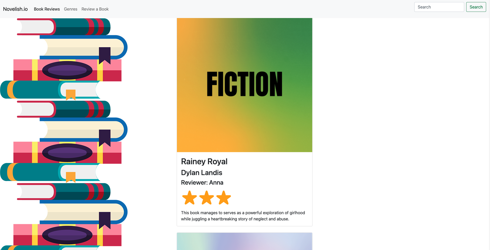
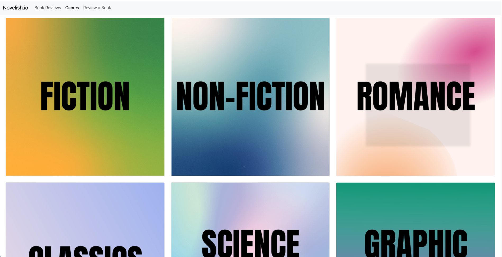
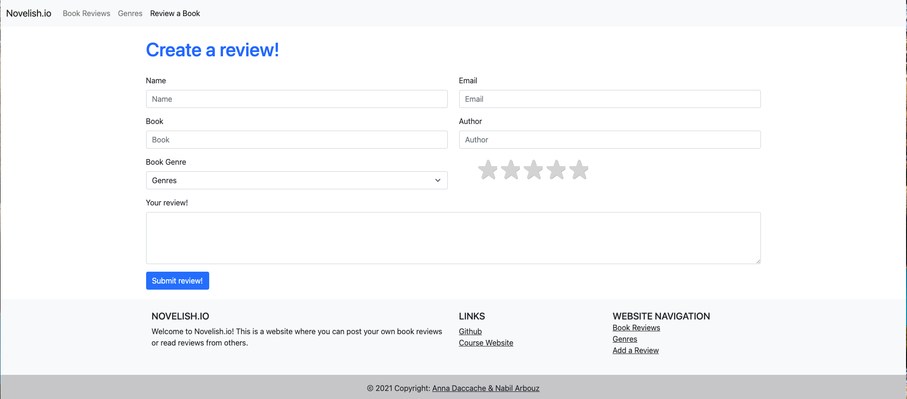
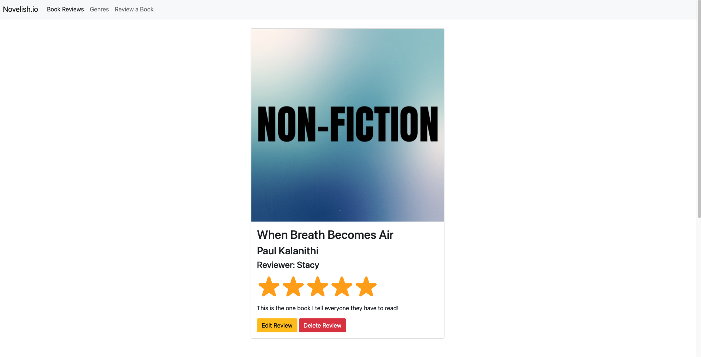
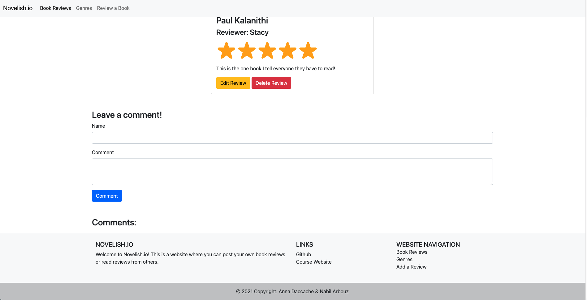

# novelish.io
By [Nabil Arbouz](http://github.com/nabilarbouz) and [Anna Daccache](https://github.com/amdacccache)

Website for project 2 in [CS5610 Web Development](https://johnguerra.co/classes/webDevelopment_spring_2021/). The goal was to build a web application that demonstrated our ability to incorporate node.js, express, and 2 MongoDB collections. Our project is a book directory that allows you to review and rate books and see reviews from others. You can watch a video demo of our site [here](https://youtu.be/085D7ujU7Lk).


## Screenshots
### Home Page

### Genres Page

### Review Form

### Single Review Comments Page



> The background image was sourced from [here](https://d33wubrfki0l68.cloudfront.net/7ae0f1087ad7b580adbe96cae82d2653f044f3a0/f4a3c/marketing_site/images/bookstack.png).

## How to Start

Download or clone this repository. Then in your terminal use: 
```
npm install
npm run start
```
in order to download the dev tools and packages used in this application. We used Prettier to format this code and the project was linted with ESLint.
In order to get the MongoDB working, create a ".env" file in your project folder. Create a variable in the .env file called MONGO_URL and set it equal to your Mongo connection string.

## Folders

- Public: contains the HTML files and several other folders
    - images: holds the card images, tab icon, and README screenshots
    - javascripts: contains the js files
    - stylesheets: contains the CSS stylesheets for their respective HTML files
- Routes: contains the js files that run the express routing to handle the URIs reponse to client requests
- db: contains a js folder that connects the functionality established in the routes to respective collections in MongoDB

## Licensing

> You can check out the full license [here](/LICENSE)

This project is licensed under the terms of the **MIT** license.
